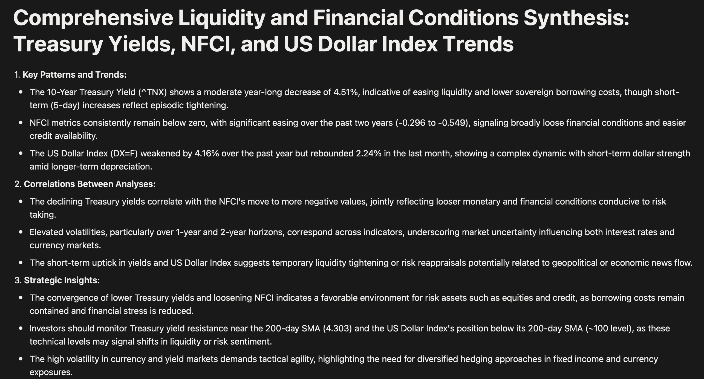
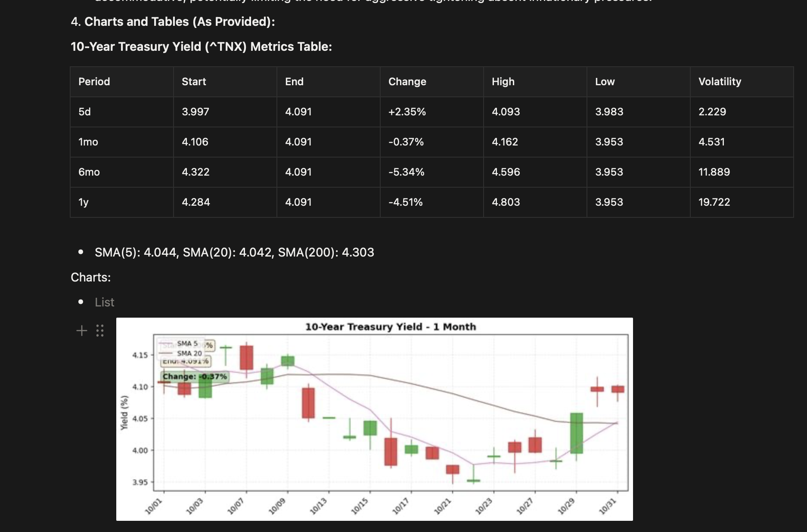
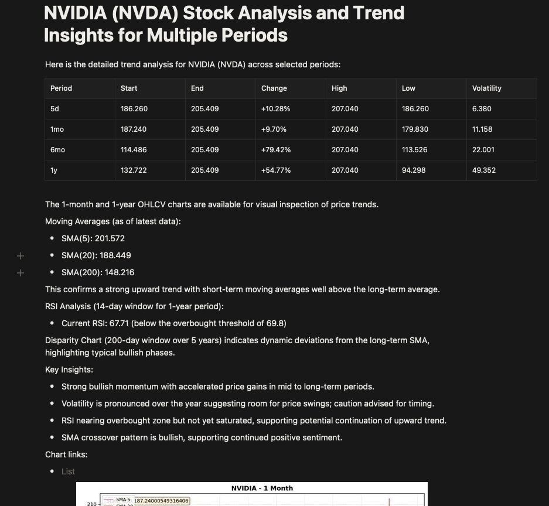

# Stock Market Analysis Agent

AI-powered comprehensive market analysis with automated Notion reporting.

## 📊 Example Output







*Automated market analysis reports with charts, tables, and AI-generated insights published to Notion*

### Live Example Reports

**English**: [Comprehensive Market Insights - October 2025](https://seunggu-kang.notion.site/Comprehensive-Market-Insights-and-Synthesis-Report-October-2025-Week-5-Year-2025-29d62b45fc808134ae62e76a2dc06ccf?pvs=74)

**Korean**: [종합 시장 분석 리포트 - 2025년 10월](https://seunggu-kang.notion.site/2025-10-29d62b45fc808174aeb6f355f8eaab1d?pvs=74)

---

## Quick Start

### 1. Install uv

```bash
curl -LsSf https://astral.sh/uv/install.sh | sh
source $HOME/.local/bin/env
```

Check installation:
```bash
uv --version
```

### 2. Install packages

```bash
uv run
```

### 3. Set up environment variables

Create `.env` file in project root:

```bash
GOOGLE_API_KEY=XXX
OPENAI_API_KEY=XXX
FRED_API_KEY=XXX
FINNHUB_API_KEY=XXX
NOTION_API_KEY=XXX
NOTION_DATABASE_ID=XXX
R2_ACCESS_KEY_ID=XXX
R2_SECRET_ACCESS_KEY=XXX
...
```

### 4. Configure language

Edit `src/config.py`:
```python
REPORT_LANGUAGE = "Korean"  # Options: "English" or "Korean"
```

### 5. Run market report

```bash
uv run python src/run_market_report.py
```

---

## TODO

- [ ] API Verificator (Only return values when tool gets 200 request status)
- [ ] Table and charts correspond to the requirements
- [ ] Chart analyzer (signal catcher - SMA 50&200, RSI, Disparity, W, M, Cup and handle)
- [ ] Cross chart checker
- [ ] Vision API integration for Koyfin chart interpretation
  - Replace brittle Selenium pixel parsing with Claude/GPT-4V
  - Capture screenshot → Vision API analyzes Forward P/E/PEG values
  - More robust to UI changes, more agentic approach


---

## Project Architecture

```
src/
├── config.py                   # Global configuration (language settings)
│
├── agent/                      # AI Agent implementations (organized by role)
│   ├── base/                  # 🏗️ Base abstract classes
│   │   ├── __init__.py       # Exports: AsyncAgent, OrchestratorAgent, TrendAgent
│   │   ├── async_agent.py    # Base class for async agents (Template Method pattern)
│   │   ├── orchestrator_agent.py  # Base class for orchestrators (parallel execution)
│   │   └── trend_agent.py    # Base class for trend analysis (simplified, tool-agnostic)
│   │
│   ├── tools/                 # 🛠️ Modular function tools (v7.2 - HY Spread & VIX)
│   │   └── agent_tools.py    # 17 independent @function_tool for agents
│   │                         # • fetch_data
│   │                         # • analyze_OHLCV, analyze_SMA, analyze_disparity, analyze_RSI
│   │                         # • analyze_market_breadth, analyze_bull_bear_spread, analyze_put_call
│   │                         # • analyze_NFCI, analyze_margin_debt, analyze_high_yield_spread, analyze_vix
│   │                         # • generate_OHLCV_chart, generate_disparity_chart, generate_RSI_chart
│   │                         # • generate_market_breadth_chart, generate_bull_bear_spread_chart, generate_put_call_chart
│   │                         # • generate_NFCI_chart, generate_margin_debt_chart, generate_high_yield_spread_chart, generate_vix_chart
│   │                         # • Dynamic overbought/oversold thresholds (80th/10th percentile)
│   │                         # • Cache-based, complete layer separation
│   │
│   ├── trend/                 # 📈 Trend analysis agents
│   │   ├── __init__.py       # Exports: TNXAgent, NFCIAgent, DXAgent, EquityTrendAgent, MarketBreadthAgent,
│   │   │                     # BullBearSpreadAgent, PutCallAgent, MarginDebtAgent, HighYieldSpreadAgent, VIXAgent
│   │   ├── tnx_agent.py      # Treasury yield (^TNX) analysis
│   │   ├── nfci_agent.py     # NFCI (National Financial Conditions Index) analysis
│   │   ├── dx_agent.py       # Dollar Index (DX=F) analysis
│   │   ├── equity_trend_agent.py  # Stock price trend analysis
│   │   ├── market_breadth_agent.py  # S&P 500 market breadth (50-day & 200-day MA)
│   │   ├── bull_bear_spread_agent.py  # AAII Bull-Bear Spread (investor sentiment)
│   │   ├── put_call_agent.py      # CBOE Equity Put/Call Ratio
│   │   ├── margin_debt_agent.py   # FINRA Margin Debt (YoY %)
│   │   ├── high_yield_spread_agent.py  # ICE BofA High Yield Spread (credit risk)
│   │   └── vix_agent.py           # VIX (Volatility Index, fear gauge)
│   │
│   ├── orchestrator/          # 🎭 Orchestrator agents (combine multiple agents)
│   │   ├── __init__.py       # Exports: LiquidityAgent, BroadIndexAgent, MarketReportAgent
│   │   ├── liquidity_agent.py     # Liquidity orchestrator (TNX + NFCI + DX)
│   │   ├── broad_index_agent.py   # Broad index orchestrator (^GSPC + ^IXIC + ^DJI + MarketBreadth)
│   │   └── market_report_agent.py  # Main report agent (Liquidity + BroadIndex + Equity)
│   │
│   └── types/                 # 📋 Type definitions
│       ├── __init__.py       # Package initialization
│       └── analysis_report.py  # AnalysisReport Pydantic model
│   │
│   └── email_agent.py         # 📧 Email notification agent
│
├── data_sources/              # 📊 Data source system (modular architecture)
│   ├── base.py               # Base classes: DataSource, APIDataSource, WebDataSource
│   │                         # • Generic _load_local_cache & _save_local_cache for web sources
│   │                         # • Weekend-aware cache freshness logic
│   ├── api/                  # API-based sources (memory cache)
│   │   ├── yfinance_source.py   # Stocks, ETFs, treasuries (chart_type: 'candle'/'line')
│   │   ├── fred_source.py       # Economic indicators (chart_type: 'line')
│   │   └── finnhub_source.py    # Company fundamentals
│   ├── web/                  # Web scraping sources (file cache)
│   │   ├── investing_source.py  # Market breadth (S5FI, S5TH)
│   │   ├── aaii_source.py       # Investor sentiment (Bull-Bear Spread)
│   │   ├── ycharts_source.py    # Put/Call Ratio (CBOE_PUT_CALL_EQUITY)
│   │   └── finra_source.py      # Margin Debt (MARGIN_DEBT_YOY)
│   └── tests/                # 34 comprehensive unit tests
│       └── data_sources_test.py
│
├── utils/                      # Utility modules
│   ├── charts.py              # Chart generation system
│   │   ├── create_yfinance_chart()  # Candlestick with SMA overlays (called by DataSource.create_chart)
│   │   ├── create_fred_chart()      # FRED line chart with baseline (called by DataSource.create_chart)
│   │   └── create_line_chart()      # Generic line chart with thresholds (called by DataSource.create_chart)
│   │                          # • All charts now called via DataSource.create_chart(chart_type, **kwargs)
│   │                          # • agent_tools.py never calls chart functions directly
│   ├── technical_indicators.py  # Technical analysis pure functions
│   │                          # • calculate_sma, calculate_disparity, calculate_rsi
│   │                          # • Used by agent_tools.py
│   │                          # • No agent coupling (pure calculation)
│   └── charts_test.py         # Unit tests (7 tests, Mock API)
│
├── services/                   # Business logic services
│   ├── image_service.py       # Image processing & Cloudflare R2 upload
│   └── image_service_test.py  # Unit tests
│
├── adapters/                   # External API integrations
│   ├── notion_api.py          # Notion API client (page creation & upload)
│   ├── markdown_to_notion.py  # Advanced markdown parser → Notion blocks converter
│   │                          # • 3-level nested lists (numbered → bulleted → bulleted)
│   │                          # • Pythonic recursive parsing
│   │                          # • Proper indentation handling
│   │                          # • Notion API limitations handling (h4-h6, numbered lists)
│   ├── report_builder.py      # Parent-child page structure builder
│   ├── notion_api_test.py     # Unit tests
│   ├── markdown_to_notion_test.py  # Unit tests (18 tests, all passing)
│   └── report_builder_test.py # Integration tests
│
└── dep/                        # Deprecated/legacy code
    ├── agent.py
    └── market_agent.py
```

---

## Program Workflow

### 1. Main Orchestration (`run_market_report.py`)

```
┌─────────────────────────────────────────────────────────────┐
│                    run_market_report.py                     │
│                                                             │
│  1. Direct Agent Execution                                  │
│     ├── MarketReportAgent (Top-level Orchestrator)          │
│     │   ├── LiquidityAgent (TNX + NFCI + DX)                │
│     │   ├── BroadIndexAgent (Indices + Market Indicators)   │
│     │   │   ├── S&P 500 (^GSPC)                             │
│     │   │   ├── Nasdaq Composite (^IXIC)                    │
│     │   │   ├── Dow Jones Industrial Average (^DJI)         │
│     │   │   ├── MarketBreadthAgent (S5FI + S5TH)            │
│     │   │   ├── BullBearSpreadAgent (AAII sentiment)        │
│     │   │   ├── PutCallAgent (CBOE Put/Call ratio)          │
│     │   │   ├── MarginDebtAgent (FINRA leverage)            │
│     │   │   ├── HighYieldSpreadAgent (Credit risk)          │
│     │   │   └── VIXAgent (Volatility/fear gauge)            │
│     │   └── EquityTrendAgent (Stock Analysis + Technicals)  │
│     │       • 4-period analysis (5d/1mo/6mo/1y)             │
│     │       • Candlestick charts with moving averages       │
│     │       • Technical indicators (SMA, RSI, Disparity)    │
│     │                                                       │
│     └── Synthesis Agent (Combined Analysis)                 │
│                                                             │
│  2. Image Processing & Notion Publishing                    │
│     • find_local_images() - Parse chart links               │
│     • upload_images_to_cloudflare() - R2 storage            │
│     • upload_report_with_children() - Parent-child pages    │
│     • Child pages: Liquidity | BroadIndex | Equity | etc.   │
│     • Markdown → Notion with hyperlink support              │
└─────────────────────────────────────────────────────────────┘
```

### 2. Detailed Flow

#### Phase 1: Data Collection & Analysis
```
User Request → run_market_report()
                        ↓
        ┌───────────────┼───────────────┐
        ↓               ↓               ↓
  LiquidityAgent  BroadIndexAgent  EquityTrendAgent
  (3 agents)      (9 agents)       (Stock Analysis)
        ↓               ↓               ↓
                                        
┌─── LiquidityAgent ───────┐  ┌────── BroadIndexAgent ────────┐
│ • TNXAgent               │  │ Indices:                       │
│ • NFCIAgent              │  │ • S&P 500 (^GSPC)              │
│ • DXAgent                │  │ • Nasdaq (^IXIC)               │
│ ↓                        │  │ • Dow Jones (^DJI)             │
│ Synthesis (Liquidity)    │  │                                │
└──────────────────────────┘  │ Market Indicators:             │
                              │ • MarketBreadthAgent           │
                              │   - S5FI (50-day MA)           │
                              │   - S5TH (200-day MA)          │
                              │ • BullBearSpreadAgent          │
                              │   - AAII investor sentiment    │
                              │ • PutCallAgent                 │
                              │   - CBOE Put/Call ratio        │
                              │ • MarginDebtAgent              │
                              │   - FINRA margin debt YoY      │
                              │ • HighYieldSpreadAgent         │
                              │   - Credit risk indicator      │
                              │ • VIXAgent                     │
                              │   - Volatility/fear gauge      │
                              │ ↓                              │
                              │ Synthesis (Broad Index)        │
                              └────────────────────────────────┘

                          EquityTrendAgent
                          • fetch_data (longest period first)
                          • analyze_OHLCV (all periods)
                          • generate_OHLCV_chart (with SMAs)
                          • Technical indicators (RSI, Disparity)
                          • Markdown table output

        ↓               ↓               ↓
        └───────────────┼───────────────┘
                        ↓
            MarketReportAgent Synthesis
            (Combined Analysis Results)
```

#### Phase 2: Report Synthesis
```
MarketReportAgent Synthesis (GPT-4o-mini)
  ↓
  Inputs:
  • LiquidityAgent (TNX + NFCI + DX)
  • BroadIndexAgent (9 indicators):
    - Major indices (^GSPC, ^IXIC, ^DJI)
    - Market breadth (S5FI, S5TH)
    - Sentiment (Bull-Bear Spread, Put/Call)
    - Leverage (Margin Debt YoY)
    - Credit risk (High Yield Spread)
    - Volatility (VIX)
  • EquityTrendAgent (Stock analyses)
  ↓
  • Cross-market correlation analysis
  • Identify divergences and confirmations
  • Strategic insights & recommendations
  • AnalysisReport generation
  ↓
AnalysisReport {
  title: str                      # Week-specific title
  summary: str                    # Executive summary
  content: str                    # Comprehensive analysis
}
```

#### Phase 3: Image Processing & Notion Publishing
```
upload_report_with_children(title, date, summary, child_pages, uploaded_map)
  ↓
  1. Create Parent Page
     • Title: Agent-generated report title
     • Content: Report date + executive summary
     ↓
  2. Process Images (for all pages)
     • find_local_images(all_content)
       - Parse markdown for sandbox:/ links
       - Replace with placeholders: {{IMAGE_PLACEHOLDER:path}}
     • upload_images_to_cloudflare(image_files)
       - Upload to R2 storage (candlestick charts + SMA overlays)
       - Return {local_path: public_url} mapping
     ↓
  3. Create Child Pages
     For each child_page: (title, content)
       • MarkdownToNotionParser.parse(content)
         - Parse markdown: headings, lists, tables, code blocks
         - Convert formatting: **bold**, *italic*, `code`
         - Convert hyperlinks: [text](https://...) → Notion links
         - Convert standalone URLs: https://... → clickable links
         - Handle 3-level nested lists (numbered → bulleted → bulleted)
         - Smart indentation detection and hierarchy recognition
         - Replace placeholders with embed blocks
         - Split text into 2000-char chunks
       • create_child_page(parent_id, title, content, uploaded_map)
         - POST to Notion API with parent_page_id
         - PATCH remaining blocks (100 per batch)
     ↓
  Child Pages (varies by sub-agents):
     • Liquidity Analysis (TNX + NFCI + DX charts)
     • Broad Index Analysis (9 indicators):
       - Major indices charts (^GSPC, ^IXIC, ^DJI)
       - Market breadth indicators (S5FI, S5TH)
       - Sentiment indicators (Bull-Bear Spread, Put/Call)
       - Leverage indicator (Margin Debt YoY)
       - Credit risk indicator (High Yield Spread)
       - Volatility indicator (VIX)
     • Equity Analysis (stocks with candlestick + SMA + technical indicators)  
     • Market Strategy Summary (comprehensive synthesis)
     ↓
  ✅ Published Notion Page with Children
```

---

## Key Components

### Language Configuration
**Set in `src/config.py`:**
```python
REPORT_LANGUAGE = "Korean"  # or "English"
```
- All agent outputs adapt to this setting
- Page titles, summaries, and reports generated in configured language
- No hardcoded language strings in the codebase

### Agent Architecture

#### Base Classes (`agent/base/`)

**AsyncAgent (Template Method Pattern):**
- `_setup()`: Hook for subclass initialization
- `_create_agent()`: Agent creation with tools & instructions
- `run()`: Execute agent with user message

**OrchestratorAgent (extends AsyncAgent):**
- `sub_agents`: List of agents to orchestrate
- `synthesis_agent`: Agent for combining results
- `run()`: Parallel execution + synthesis
- `_create_synthesis_prompt()`: Abstract method for custom synthesis

**TrendAgent (extends AsyncAgent):**
- Tool-agnostic base class (simplified)
- Context-aware instructions with `label` and `description` parameters
- `label`: Human-readable name (e.g., "S&P 500" for "^GSPC")
- `description`: Brief asset description (optional)
- Extensible for any ticker/indicator
- Tools selected by subclasses from `agent_tools.py`
- **Common Instructions** (in base class):
  * `fetch_data()` must be called for longest period first (cache optimization)
  * Markdown table output format
  * Chart link inclusion rules
- **Subclass Instructions**: Only specific tool usage and analysis focus

#### Concrete Implementations

**Trend Agents (`agent/trend/`):**
- `TNXAgent`: Treasury yield (^TNX via yfinance)
- `NFCIAgent`: Financial conditions (NFCI via FRED)
- `DXAgent`: Dollar Index (DX=F via yfinance)
- `EquityTrendAgent`: Stock analysis (NVDA/SPY via yfinance)
- `MarketBreadthAgent`: S&P 500 breadth (S5FI/S5TH via Investing.com)
- `BullBearSpreadAgent`: Investor sentiment (AAII via web scraping)
- `PutCallAgent`: Options sentiment (CBOE via YCharts)
- `MarginDebtAgent`: Leverage indicator (FINRA via web scraping)
- `HighYieldSpreadAgent`: Credit risk (BAMLH0A0HYM2 via FRED)
- `VIXAgent`: Volatility/fear gauge (^VIX via yfinance)

**Orchestrators (`agent/orchestrator/`):**
- `LiquidityAgent`: TNXAgent + NFCIAgent + DXAgent (3 agents)
- `BroadIndexAgent`: 3 major indices + 6 market indicators (9 agents)
- `MarketReportAgent`: LiquidityAgent + BroadIndexAgent + EquityTrendAgent
- **Synthesis Instructions**: Explicit content preservation rules
  * All chart links must be included (count and verify)
  * All reference links (external URLs) must be preserved
  * Tables: Can summarize but must include full structure
  * Analysis text: Can summarize if too long, but never omit links

### Unified Data Source System

**`data_sources.py` - Extensible Architecture:**
- `DataSource` (ABC): Base class for all data sources
  - `fetch_data()`: Retrieve data
  - `create_chart()`: Generate visualizations
  - `get_analysis()`: Extract metrics

**API Data Sources:**
- `YFinanceSource`: Stocks, ETFs, indices (^TNX, ^VIX, AAPL, SPY)
  - Automatic SMA calculation (5/20/200-day)
  - Supports both candlestick and line charts
  - Extended data fetching for SMA 200 (period + 280 days)
- `FREDSource`: Economic indicators (NFCI, BAMLH0A0HYM2, DFF, T10Y2Y)
  - High Yield Spread (BAMLH0A0HYM2)
  - Lazy initialization for FRED API key
  - Line charts with baseline support
- `FinnhubSource`: Company fundamentals (P/E, EPS estimates)

**Web Data Sources:**
- `InvestingSource`: S&P 500 market breadth (S5FI, S5TH)
  - Web scraping with validation-based caching
  - Auto-merge to `data/market_breadth_history.json`
- `AAIISource`: Investor sentiment (Bull-Bear Spread)
  - Weekly survey data from aaii.com
  - 2-day date offset tolerance
- `YChartsSource`: Options sentiment (CBOE Put/Call Equity)
  - Weekend-aware caching
- `FINRASource`: Margin statistics (MARGIN_DEBT_YOY)
  - 333 months historical data (1998-2025)
  - Automatic YoY calculation

**Explicit Source Selection:**
```python
get_data_source("yfinance")   # → YFinanceSource
get_data_source("fred")       # → FREDSource
get_data_source("investing")  # → InvestingSource
get_data_source("aaii")       # → AAIISource
get_data_source("ycharts")    # → YChartsSource
get_data_source("finra")      # → FINRASource
```

**Modular Agent Tools (`agent/tools/agent_tools.py`):**

**Data Layer:**
- `fetch_data(source, symbol, period)`: Fetch and cache data from yfinance/FRED

**Analysis Layer (17 tools):**
- **Price/Technicals**: `analyze_OHLCV`, `analyze_SMA`, `analyze_disparity`, `analyze_RSI`
- **Market Indicators**: `analyze_market_breadth`, `analyze_bull_bear_spread`, `analyze_put_call`
- **Risk Indicators**: `analyze_NFCI`, `analyze_margin_debt`, `analyze_high_yield_spread`, `analyze_vix`

**Chart Layer:**
- **Price Charts**: `generate_OHLCV_chart` (candlestick/line)
- **Technical Charts**: `generate_disparity_chart`, `generate_RSI_chart`
- **Market Indicators**: `generate_market_breadth_chart`, `generate_bull_bear_spread_chart`, `generate_put_call_chart`
- **Risk Indicators**: `generate_NFCI_chart`, `generate_margin_debt_chart`, `generate_high_yield_spread_chart`, `generate_vix_chart`

**Unified Charting (`charts.py`):**
- `create_chart()`: Universal chart generator
  - Handles both DataFrame (yfinance) and Series (FRED)
  - Automatic baseline detection for FRED indicators
  - Consistent styling across all chart types
- **Candlestick Charts with SMA Overlays:**
  - OHLC (Open, High, Low, Close) candlestick visualization
  - 5-day, 20-day, 200-day Simple Moving Averages
  - Conditional SMA display based on chart period:
    * No SMAs for 5-day charts
    * SMA 5, 20 for 1mo, 3mo, 6mo periods
    * SMA 5, 20, 200 for 1y+ periods
  - Weekend/holiday gap removal for continuous display
  - Distinct colors and line weights for each SMA

### Report Builder
**`upload_report_with_children()`:**
- Creates parent page with title, date, and summary
- Generates child pages with agent-provided titles
- Processes images once for all pages (shared uploaded_map)
- Returns parent page ID and URL

### External Integrations

**Cloudflare R2:**
- Image storage with public URLs
- Configured via `R2_*` environment variables

**Notion API:**
- Version: `2025-09-03`
- Uses `embed` blocks for external images
- **MarkdownToNotionParser** (Advanced Features):
  - **3-Level Nested Lists**: numbered → bulleted → bulleted
  - **Pythonic Recursive Parsing**: Clean, maintainable code
  - **Smart Indentation Detection**: Automatic hierarchy recognition
  - **Notion API Compatibility**: `paragraph` + `children` structure
  - **Supports**: headings (h1-h6), tables, code blocks, formatting
  - **Handles**: bold, italic, bold-italic, inline code
  - **Hyperlink Support**: 
    * Auto-converts `[text](https://...)` markdown links to Notion hyperlinks
    * Auto-converts standalone URLs (`https://...`) to clickable links
    * Chart links (`sandbox:`) remain separate (converted to R2 image embeds)
  - **Respects Notion limits**: 2000 chars per block, 100 blocks per page
  - **Test Coverage**: 30 comprehensive tests, all passing

---

## Recent Improvements

### High Yield Spread & VIX Agents + Sentiment Refactoring (v7.2)

**Date: November 9, 2025**

**Major Updates:**

**1. High Yield Spread Agent:**
- **New Agent**: `HighYieldSpreadAgent` in `src/agent/trend/high_yield_spread_agent.py`
  - FRED data source: `BAMLH0A0HYM2` (ICE BofA US High Yield Index)
  - Credit risk and contrarian sentiment indicator
  - Critical thresholds: >5% (alert), >7% (crisis), Peak→Declining (buy)
  - 10-year historical analysis for long-term perspective
- **New Tools**: `analyze_high_yield_spread`, `generate_high_yield_spread_chart`
  - Analysis periods: 6mo, 1y tables | 10y chart
  - Leads equity market by 1-2 months during stress periods

**2. VIX Agent:**
- **New Agent**: `VIXAgent` in `src/agent/trend/vix_agent.py`
  - YFinance data source: `^VIX` (CBOE Volatility Index)
  - Market fear gauge and contrarian indicator
  - Critical thresholds: >30 (extreme fear/buy), <12 (complacency/sell)
  - 2,512 data points covering 10 years of volatility history
- **New Tools**: `analyze_vix`, `generate_vix_chart`
  - Analysis periods: 5d, 1mo tables | 1y chart
  - Inversely correlates with S&P 500, spikes mark market bottoms

**3. Sentiment Agent Refactoring:**
- **Renamed**: `SentimentAgent` → `BullBearSpreadAgent`
  - More descriptive naming (Bull-Bear Spread vs generic Sentiment)
  - Function renaming: `analyze_sentiment` → `analyze_bull_bear_spread`
  - Function renaming: `generate_sentiment_chart` → `generate_bull_bear_spread_chart`

**4. Bug Fixes:**
- Fixed pandas FutureWarning in volatility calculations
- Added `fill_method=None` to `pct_change()` calls

**Impact:**
- ✅ 3 new sentiment/volatility indicators for comprehensive market analysis
- ✅ Credit risk monitoring with 5%/7% alert thresholds
- ✅ VIX fear gauge for contrarian market timing (>30 buy signal)
- ✅ Clearer agent naming (Bull-Bear Spread vs generic Sentiment)
- ✅ No deprecation warnings

---

### FINRA Margin Debt Integration (v7.1)

**Date: November 8, 2025**

**Major Updates:**

**1. FINRA Margin Statistics Data Source:**
- **New DataSource**: `FINRASource` in `src/data_sources/web/finra_source.py`
  - Web scraping from finra.org margin statistics page
  - Symbol: `MARGIN_DEBT_YOY` (Year-over-Year change percentage)
  - Automatic YoY calculation (12-month pct_change)
  - File-based caching with `_validated` flag
  - Extensible SYMBOL_CONFIG structure for future additions
- **Historical Data**: `data/margin_debt_history.json`
  - 333 monthly data points (1998-01 ~ 2025-09)
  - Latest: +38.52% YoY (approaching extreme leverage zone)
  - Format unified with other web sources

**2. Margin Debt Analysis Agent:**
- **New Agent**: `MarginDebtAgent` in `src/agent/trend/margin_debt_agent.py`
  - Contrarian sentiment indicator (leverage as market overheating signal)
  - Critical thresholds:
    * 🔴 Sell: YoY > +50% | Peak → below 50%
    * 🟡 Buy: YoY < -20% | YoY < -30% | Trough → above -20%
  - Historical leading indicator (1-3 months before market moves)
- **New Tools**: `analyze_margin_debt`, `generate_margin_debt_chart`
  - Analysis periods: 6mo tables, 10y charts
  - Threshold visualization: +50% (Extreme Leverage), -20% (Deleveraging)

**3. Chart Filename Bug Fix:**
- **Problem**: `%` symbol in filenames broke URL loading in Notion
  - `Margin_Debt_YoY_%_10y_chart.png` → Failed to load
- **Solution**: Replace `%` with `pct` in all chart generation functions
  - `Margin_Debt_YoY_pct_10y_chart.png` → Loads successfully
- **Applied to**: `create_yfinance_chart`, `create_fred_chart`, `create_line_chart`

**4. Testing:**
- 6 comprehensive tests for FINRA data source
- Mock scraping, cache validation, error handling
- All tests passing

**Impact:**
- ✅ Margin Debt as contrarian leverage indicator (빚투 지표)
- ✅ 333 months of historical data (1998-2025) for long-term analysis
- ✅ Chart filename URL compatibility fixed (% → pct)
- ✅ Extensible structure for future FINRA indicators

---

## Usage Examples

### Import Agents

```python
from src.agent.trend import (
    TNXAgent, NFCIAgent, DXAgent, EquityTrendAgent,
    MarketBreadthAgent, BullBearSpreadAgent, PutCallAgent,
    MarginDebtAgent, HighYieldSpreadAgent, VIXAgent
)
from src.agent.orchestrator import LiquidityAgent, BroadIndexAgent, MarketReportAgent

# Initialize agents
vix_agent = VIXAgent()                       # VIX volatility analysis
margin_agent = MarginDebtAgent()             # FINRA margin debt analysis
hy_spread_agent = HighYieldSpreadAgent()     # High yield spread analysis
broad_index_agent = BroadIndexAgent()        # Full broad index orchestrator
```

### Run Full Market Analysis

```python
import asyncio
from src.run_market_report import run_market_report

async def main():
    result = await run_market_report()
    print(f"✅ Report published: {result['url']}")

asyncio.run(main())
```

---

## Testing

**Run all tests:**
```bash
uv run python -m unittest discover src -p "*_test.py"
```

**Test Coverage:** 71+ tests covering data sources, charts, agents, and integrations

---

## Known Limitations

### Forward P/E (NTM) Data - Koyfin Automation

**Current Implementation:**
- Uses Selenium + Firefox to capture Forward P/E and PEG charts from Koyfin
- ~12-15 seconds per ticker
- Extracts metrics by parsing page source HTML

**Why This Approach:**
- ❌ **No free API** provides historical Forward P/E (NTM) data
  - Finnhub, yfinance, Alpha Vantage: Only current values or inaccurate
  - Koyfin: Accurate market consensus but no public API
- ✅ **Best available option** for accurate historical valuation data

**Known Issues:**
- **Brittle**: Breaks if Koyfin changes UI structure
- **Slow**: ~12-15 seconds per ticker (vs <1s for APIs)
- **Non-agentic**: Hardcoded script instead of AI decision-making
- **Maintenance**: Requires updates when Koyfin changes
- **Dependency**: Requires Firefox WebDriver

**Future Plans:**
- **Short-term**: Vision API integration (Claude/GPT-4V) to interpret screenshots
  - More robust to UI changes
  - More agentic approach (AI reads charts)
  - Added to TODO list
- **Long-term**: Replace with paid API when budget allows (Bloomberg/FactSet)

**Related Files:**
- `src/utils/koyfin_chart_capture.py`
- `src/agent/tools/agent_tools.py`: `generate_PE_PEG_ratio_chart()`

---

## Version History

For detailed changelog including v7.0 and earlier versions, see [CHANGELOG.md](CHANGELOG.md).

---
