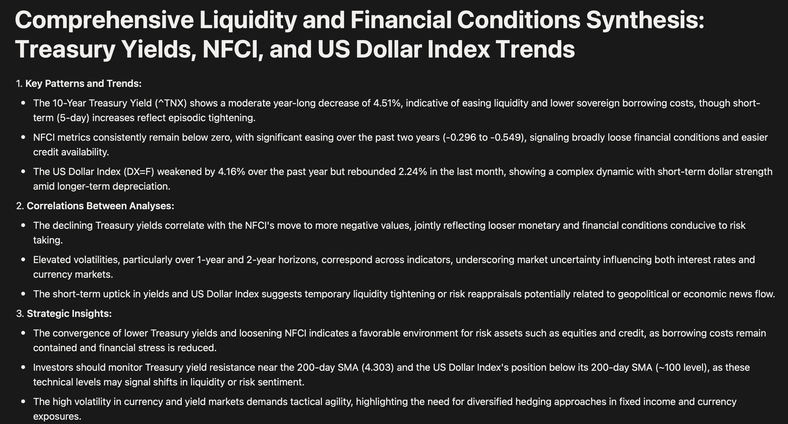
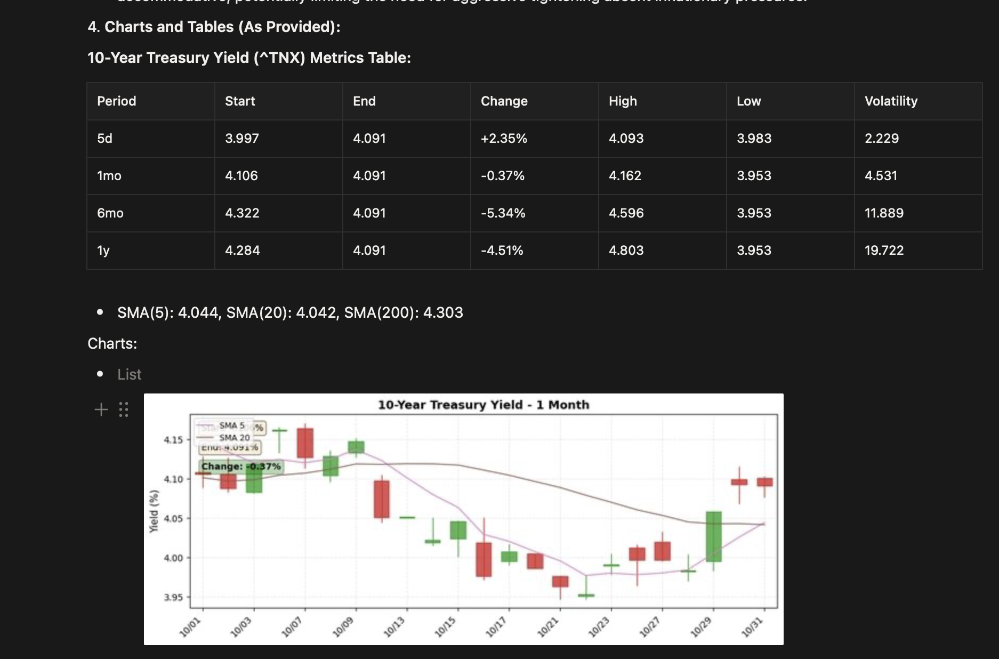
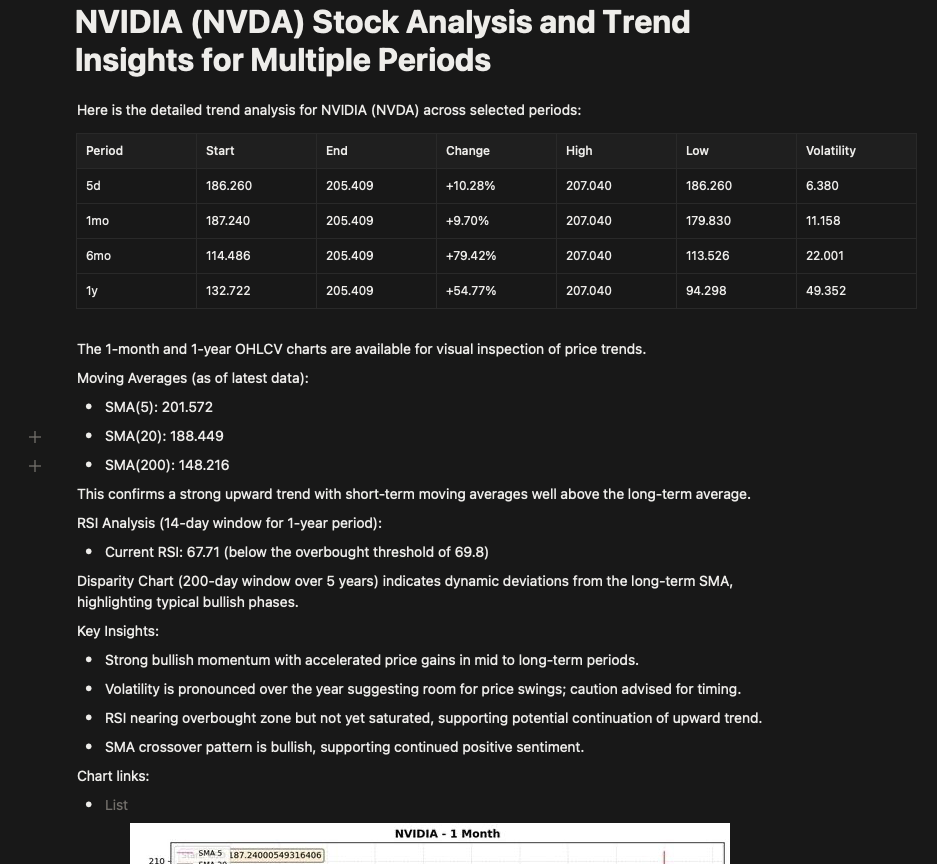

# Stock Market Analysis Agent

AI-powered comprehensive market analysis with automated Notion reporting.

## 📊 Example Output







*Automated market analysis reports with charts, tables, and AI-generated insights published to Notion*

### Recent Reports
- [2026-04-13](https://seunggu-kang.notion.site/2026-4-Week-2-34162b45fc80810795c1d0f9bd80c74f)
- [2026-04-06](https://seunggu-kang.notion.site/2026-4-Week-1-33a62b45fc808100bbd0fab2e222181f)
- [2026-04-02](https://seunggu-kang.notion.site/2026-4-1-33662b45fc808118a7d3dff7d6b9acb8)
- [2026-03-16](https://seunggu-kang.notion.site/2026-3-3-32562b45fc8081739692e96c52db93b5)
- [2026-03-09](https://seunggu-kang.notion.site/2026-3-Week-2-31e62b45fc808116b911fbbca5de0d5d)
- [2026-03-02](https://seunggu-kang.notion.site/2026-3-3-2-31762b45fc80811b93d2e496031a4592)
- [2026-02-23](https://seunggu-kang.notion.site/2026-2-Week-3-31062b45fc80818b9fb2d7d02242b841)
- [2026-02-16](https://seunggu-kang.notion.site/2026-2-30962b45fc80811c9e42d768b51654fc)
- [2026-02-09](https://seunggu-kang.notion.site/2026-2-2-2-30262b45fc808148bad2cd24223e60e2)
- [2026-02-02](https://seunggu-kang.notion.site/2026-2-Week-1-2fb62b45fc8081c5b6dde45c4b4ee372)

### Latest Indicator Heatmap


*Updated: 2026-04-13*

---

## Quick Start

### 1. Install uv

```bash
curl -LsSf https://astral.sh/uv/install.sh | sh
source $HOME/.local/bin/env
```

Check installation:
```bash
uv --version
```

### 2. Install packages

```bash
uv run
```

### 3. Set up environment variables

Create `.env` file in project root:

```bash
GOOGLE_API_KEY=XXX
OPENAI_API_KEY=XXX
FRED_API_KEY=XXX
FINNHUB_API_KEY=XXX
NOTION_API_KEY=XXX
NOTION_DATABASE_ID=XXX
R2_ACCESS_KEY_ID=XXX
R2_SECRET_ACCESS_KEY=XXX
...
```

### 4. Configure language

Edit `src/config.py`:
```python
REPORT_LANGUAGE = "Korean"  # Options: "English" or "Korean"
```

### 5. Run market report

```bash
uv run python src/run_market_report.py
```

---

## Automation

### GitHub Actions - Weekly Report

The repository includes a GitHub Actions workflow that automatically:
- **Runs every Monday at 9:00 AM KST**
- Generates comprehensive market report
- Uploads to Notion
- Updates README with latest report link
- Commits and pushes changes

**Setup:**

1. **Add GitHub Secrets** (Settings → Secrets → Actions):
   ```
   GOOGLE_API_KEY
   OPENAI_API_KEY
   FRED_API_KEY
   FINNHUB_API_KEY
   NOTION_API_KEY
   NOTION_DATABASE_ID
   R2_ACCESS_KEY_ID
   R2_SECRET_ACCESS_KEY
   R2_ACCOUNT_ID
   R2_BUCKET_NAME
   R2_PUBLIC_BUCKET_NAME
   ```

2. **Enable Workflow Permissions**:
   - Settings → Actions → General → Workflow permissions
   - Select "Read and write permissions"
   - Check "Allow GitHub Actions to create and approve pull requests"

3. **Manual Trigger** (optional):
   - Actions tab → "Weekly Market Report" → Run workflow

**Workflow File:** `.github/workflows/weekly-report.yml`

---

## TODO

- [ ] Guardrail System (Input/Output validation)
  - Data Source Guardrail: Validate fetched data quality (empty check, freshness, min data points)
  - Score Guardrail: Validate score range (1-5) in all analyze functions
  - Period Guardrail: Validate period parameter against allowed values
  - Output Guardrail: Validate AnalysisReport completeness (chart links, reference links, min length)
  - Koyfin Scraping Guardrail: Validate extracted metrics (P/E range check, required fields)
- [ ] API Verificator (Only return values when tool gets 200 request status)
- [ ] Table and charts correspond to the requirements
- [ ] Chart analyzer (signal catcher - SMA 50&200, RSI, Disparity, W, M, Cup and handle)
- [ ] Cross chart checker
- [ ] Vision API integration for Koyfin chart interpretation
  - Replace brittle Selenium pixel parsing with Claude/GPT-4V
  - Capture screenshot → Vision API analyzes Forward P/E/PEG values
  - More robust to UI changes, more agentic approach


---

## Project Architecture

```
src/
├── config.py                   # Global configuration (language settings)
│
├── agent/                      # AI Agent implementations (organized by role)
│   ├── base/                  # 🏗️ Base abstract classes
│   │   ├── __init__.py       # Exports: AsyncAgent, OrchestratorAgent, TrendAgent
│   │   ├── async_agent.py    # Base class for async agents (Template Method pattern)
│   │   ├── orchestrator_agent.py  # Base class for orchestrators (parallel execution + hook system v0.8.2)
│   │   │                     # • Hook system: on_results_collected, on_synthesis_complete
│   │   │                     # • _execute_hooks(hook_name, *args): Execute registered hook functions
│   │   │                     # • Conditional execution: Only runs if hooks are registered
│   │   └── trend_agent.py    # Base class for trend analysis (simplified, tool-agnostic)
│   │
│   ├── tools/                 # 🛠️ Modular function tools (v0.7.2 - HY Spread & VIX)
│   │   └── agent_tools.py    # 19 independent @function_tool for agents
│   │                         # • fetch_data
│   │                         # • analyze_OHLCV, analyze_SMA, analyze_disparity, analyze_RSI
│   │                         # • analyze_market_breadth, analyze_market_pe, analyze_bull_bear_spread, analyze_put_call
│   │                         # • analyze_NFCI, analyze_margin_debt, analyze_high_yield_spread, analyze_vix
│   │                         # • generate_OHLCV_chart, generate_disparity_chart, generate_RSI_chart
│   │                         # • generate_market_breadth_chart, generate_market_pe_chart, generate_bull_bear_spread_chart, generate_put_call_chart
│   │                         # • generate_NFCI_chart, generate_margin_debt_chart, generate_high_yield_spread_chart, generate_vix_chart
│   │                         # • Dynamic overbought/oversold thresholds (80th/10th percentile)
│   │                         # • Cache-based, complete layer separation
│   │
│   ├── trend/                 # 📈 Trend analysis agents
│   │   ├── __init__.py       # Exports: TNXAgent, NFCIAgent, DXAgent, EquityTrendAgent, MarketBreadthAgent,
│   │   │                     # MarketPEAgent, BullBearSpreadAgent, PutCallAgent, MarginDebtAgent, HighYieldSpreadAgent, VIXAgent
│   │   ├── tnx_agent.py      # Treasury yield (^TNX) analysis
│   │   ├── nfci_agent.py     # NFCI (National Financial Conditions Index) analysis
│   │   ├── dx_agent.py       # Dollar Index (DX=F) analysis
│   │   ├── equity_trend_agent.py  # Stock price trend analysis
│   │   ├── market_breadth_agent.py  # S&P 500 market breadth (50-day & 200-day MA)
│   │   ├── market_pe_agent.py  # S&P 500 Market P/E ratio (trailing & forward via factset_report_analyzer)
│   │   ├── bull_bear_spread_agent.py  # AAII Bull-Bear Spread (investor sentiment)
│   │   ├── put_call_agent.py      # CBOE Equity Put/Call Ratio
│   │   ├── margin_debt_agent.py   # FINRA Margin Debt (YoY %)
│   │   ├── high_yield_spread_agent.py  # ICE BofA High Yield Spread (credit risk)
│   │   └── vix_agent.py           # VIX (Volatility Index, fear gauge)
│   │
│   ├── orchestrator/          # 🎭 Orchestrator agents (combine multiple agents)
│   │   ├── __init__.py       # Exports: LiquidityAgent, BroadIndexAgent, MarketReportAgent, MarketHealthAgent, PortfolioAgent
│   │   ├── liquidity_agent.py     # Liquidity orchestrator (TNX + NFCI + DX) + score save hook (v0.8.2)
│   │   ├── broad_index_agent.py   # Broad index orchestrator (^GSPC + ^IXIC + ^DJI + MarketBreadth + MarketPE) + score save hook (v0.8.2)
│   │   ├── market_health_agent.py # Market health orchestrator (5 contrarian indicators) + score save hook (v0.8.2)
│   │   ├── portfolio_agent.py     # Portfolio orchestrator (NVDA, MSFT, SBUX, JPM, PLTR, IAU, QLD, AHR, COPX) (v0.9.0)
│   │   └── market_report_agent.py  # Main report agent (Liquidity + MarketHealth + BroadIndex + Portfolio) - no hook (prevents duplicate saves)
│   │
│   └── types/                 # 📋 Type definitions
│       ├── __init__.py       # Package initialization
│       └── analysis_report.py  # AnalysisReport + IndicatorScore Pydantic models
│   │
│   └── email_agent.py         # 📧 Email notification agent
│
├── data_sources/              # 📊 Data source system (modular architecture)
│   ├── base.py               # Base classes: DataSource, APIDataSource, WebDataSource
│   │                         # • Generic _load_local_cache & _save_local_cache for web sources
│   │                         # • Weekend-aware cache freshness logic
│   ├── api/                  # API-based sources (memory cache)
│   │   ├── yfinance_source.py   # Stocks, ETFs, treasuries (chart_type: 'candle'/'line')
│   │   ├── fred_source.py       # Economic indicators (chart_type: 'line')
│   │   └── finnhub_source.py    # Company fundamentals
│   ├── web/                  # Web scraping sources (file cache)
│   │   ├── investing_source.py  # Market breadth (S5FI, S5TH)
│   │   ├── aaii_source.py       # Investor sentiment (Bull-Bear Spread)
│   │   ├── ycharts_source.py    # Put/Call Ratio (CBOE_PUT_CALL_EQUITY)
│   │   └── finra_source.py      # Margin Debt (MARGIN_DEBT_YOY)
│   └── tests/                # 34 comprehensive unit tests
│       └── data_sources_test.py
│
├── utils/                      # Utility modules
│   ├── charts.py              # Chart generation system
│   │   ├── create_yfinance_chart()  # Candlestick with SMA overlays (called by DataSource.create_chart)
│   │   ├── create_fred_chart()      # FRED line chart with baseline (called by DataSource.create_chart)
│   │   └── create_line_chart()      # Generic line chart with thresholds (called by DataSource.create_chart)
│   │                          # • All charts now called via DataSource.create_chart(chart_type, **kwargs)
│   │                          # • agent_tools.py never calls chart functions directly
│   ├── technical_indicators.py  # Technical analysis pure functions
│   │                          # • calculate_sma, calculate_disparity, calculate_rsi
│   │                          # • Used by agent_tools.py
│   │                          # • No agent coupling (pure calculation)
│   ├── indicator_heatmap.py   # Indicator score heatmap generator (v0.8.2)
│   │                          # • generate_indicator_heatmap(cloud_path, figsize)
│   │                          # • Reads scores from R2 CSV, generates heatmap with color gradient
│   │                          # • Red (1) → Yellow (3) → Green (5) colormap
│   │                          # • Uploads to R2 and returns cloud URL
│   ├── cloudflare.py          # Cloudflare R2 storage utilities
│   ├── csv_storage.py         # CSV read/write helpers
│   └── charts_test.py         # Unit tests (7 tests, Mock API)
│
├── services/                   # Business logic services
│   ├── image_service.py       # Image processing & Cloudflare R2 upload
│   ├── image_service_test.py  # Unit tests
│   ├── score_service.py       # Score collection & persistence (v0.8.2)
│   │                          # • collect_scores(results): Extract scores from AnalysisReport
│   │                          # • save_scores_to_csv(results, cloud_path): Save to R2 CSV
│   │                          # • Used as hook in BroadIndexAgent, LiquidityAgent, MarketHealthAgent
│   └── score_service_test.py  # Unit tests (10 tests, all passing) (v0.9.0)
│
├── adapters/                   # External API integrations
│   ├── notion_api.py          # Notion API client (page creation & upload)
│   ├── markdown_to_notion.py  # Advanced markdown parser → Notion blocks converter
│   │                          # • 3-level nested lists (numbered → bulleted → bulleted)
│   │                          # • Pythonic recursive parsing
│   │                          # • Proper indentation handling
│   │                          # • Notion API limitations handling (h4-h6, numbered lists)
│   ├── notion_report_builder.py  # Hierarchical report builder with method chaining API (v0.9.0)
│   │                          # • Builder pattern for declarative report structures
│   │                          # • Supports 2-level hierarchy (parent > orchestrator > sub-agents)
│   │                          # • Automatic image processing and upload
│   ├── notion_api_test.py     # Unit tests
│   └── markdown_to_notion_test.py  # Unit tests (18 tests, all passing)
│
└── dep/                        # Deprecated/legacy code
    ├── agent.py
    ├── market_agent.py
    ├── report_builder.py      # Legacy function-based report builder (moved in v0.9.0)
    └── report_builder_test.py # Legacy tests (moved in v0.9.0)

scripts/                        # 🤖 Automation scripts (v0.9.1+)
├── __init__.py                 # Package initialization
├── generate_indicator_heatmap.py  # Heatmap generation script (v0.9.2)
│                               # • HeatmapGenerator class for encapsulated heatmap creation
│                               # • Reads scores from R2, generates color-graded visualization
│                               # • Uploads to R2 and returns cloud URL
├── update_readme.py            # README auto-update script (v0.9.1, enhanced v0.9.2)
│                               # • ReadmeUpdater class for README management
│                               # • Updates Recent Reports section (max 10, replaces same-date)
│                               # • Updates Latest Indicator Heatmap section (v0.9.2)
│                               # • Integrates heatmap generation automatically
└── update_readme_test.py       # Unit tests (6 tests, all passing) (v0.9.2)
```

---

## Program Workflow

### 1. Main Orchestration (`run_market_report.py`)

```
┌─────────────────────────────────────────────────────────────┐
│                    run_market_report.py                     │
│                                                             │
│  1. Direct Agent Execution                                  │
│     ├── MarketReportAgent (Top-level Orchestrator)          │
│     │   ├── LiquidityAgent (TNX + NFCI + DX)                │
│     │   ├── BroadIndexAgent (Indices + Market Breadth)      │
│     │   │   ├── S&P 500 (^GSPC)                             │
│     │   │   ├── Nasdaq Composite (^IXIC)                    │
│     │   │   ├── Dow Jones Industrial Average (^DJI)         │
│     │   │   └── MarketBreadthAgent (S5FI + S5TH)            │
│     │   ├── MarketHealthAgent (5 Contrarian Indicators)     │
│     │   │   ├── BullBearSpreadAgent (AAII sentiment)        │
│     │   │   ├── PutCallAgent (CBOE Put/Call ratio)          │
│     │   │   ├── MarginDebtAgent (FINRA leverage)            │
│     │   │   ├── HighYieldSpreadAgent (Credit risk)          │
│     │   │   └── VIXAgent (Volatility/fear gauge)            │
│     │   └── EquityTrendAgent (Stock Analysis + Technicals)  │
│     │       • 4-period analysis (5d/1mo/6mo/1y)             │
│     │       • Candlestick charts with moving averages       │
│     │       • Technical indicators (SMA, RSI, Disparity)    │
│     │                                                       │
│     └── Synthesis Agent (Combined Analysis)                 │
│                                                             │
│  2. Image Processing & Notion Publishing                    │
│     • find_local_images() - Parse chart links               │
│     • upload_images_to_cloudflare() - R2 storage            │
│     • upload_report_with_children() - Parent-child pages    │
│     • Child pages: Liquidity | BroadIndex | Equity | etc.   │
│     • Markdown → Notion with hyperlink support              │
└─────────────────────────────────────────────────────────────┘
```

### 2. Detailed Flow

#### Phase 1: Data Collection & Analysis
```
User Request → run_market_report()
                        ↓
        ┌───────────────┼───────────────┐
        ↓               ↓               ↓
  LiquidityAgent  BroadIndexAgent  MarketHealthAgent  EquityTrendAgent
  (3 agents)      (4 agents)       (5 agents)         (Stock Analysis)
        ↓               ↓               ↓
                                        
┌─── LiquidityAgent ───────┐  ┌───── BroadIndexAgent ─────┐  ┌──── MarketHealthAgent -────┐
│ • TNXAgent               │  │ Indices:                  │  │ Contrarian Indicators:     │
│ • NFCIAgent              │  │ • S&P 500 (^GSPC)         │  │ • BullBearSpreadAgent      │
│ • DXAgent                │  │ • Nasdaq (^IXIC)          │  │   - AAII sentiment         │
│ ↓                        │  │ • Dow Jones (^DJI)        │  │ • PutCallAgent             │
│ Synthesis (Liquidity)    │  │                           │  │   - CBOE Put/Call ratio    │
└──────────────────────────┘  │ Market Breadth:           │  │ • MarginDebtAgent          │
                              │ • MarketBreadthAgent      │  │   - FINRA margin debt YoY  │
                              │   - S5FI (50-day MA)      │  │ • HighYieldSpreadAgent     │
                              │   - S5TH (200-day MA)     │  │   - Credit risk            │
                              │ ↓                         │  │ • VIXAgent                 │
                              │ Synthesis (Broad Index)   │  │   - Volatility/fear gauge  │
                              └───────────────────────────┘  │ ↓                          │
                                                             │ Composite Score (0-5)      │
                                                             │ Synthesis (Market Health)  │
                                                             └────────────────────────────┘

                          EquityTrendAgent
                          • fetch_data (longest period first)
                          • analyze_OHLCV (all periods)
                          • generate_OHLCV_chart (with SMAs)
                          • Technical indicators (RSI, Disparity)
                          • Markdown table output

        ↓               ↓               ↓
        └───────────────┼───────────────┘
                        ↓
            MarketReportAgent Synthesis
            (Combined Analysis Results)
```

#### Phase 2: Report Synthesis
```
MarketReportAgent Synthesis (GPT-4o-mini)
  ↓
  Inputs:
  • LiquidityAgent (TNX + NFCI + DX)
  • BroadIndexAgent (4 agents):
    - Major indices (^GSPC, ^IXIC, ^DJI)
    - Market breadth (S5FI, S5TH)
  • MarketHealthAgent (5 contrarian indicators with composite score):
    - Sentiment (Bull-Bear Spread, Put/Call)
    - Leverage (Margin Debt YoY)
    - Credit risk (High Yield Spread)
    - Volatility (VIX)
  • EquityTrendAgent (Stock analyses)
  ↓
  • Cross-market correlation analysis
  • Identify divergences and confirmations
  • Strategic insights & recommendations
  • AnalysisReport generation
  ↓
AnalysisReport {
  title: str                      # Week-specific title
  summary: str                    # Executive summary
  content: str                    # Comprehensive analysis
  score: list[IndicatorScore]     # List of scores with agent/indicator/value (v0.8.0+)
}
```

#### Phase 3: Image Processing & Notion Publishing
```
upload_report_with_children(title, date, summary, child_pages, uploaded_map)
  ↓
  1. Create Parent Page
     • Title: Agent-generated report title
     • Content: Report date + executive summary
     ↓
  2. Process Images (for all pages)
     • find_local_images(all_content)
       - Parse markdown for sandbox:/ links
       - Replace with placeholders: {{IMAGE_PLACEHOLDER:path}}
     • upload_images_to_cloudflare(image_files)
       - Upload to R2 storage (candlestick charts + SMA overlays)
       - Return {local_path: public_url} mapping
     ↓
  3. Create Child Pages
     For each child_page: (title, content)
       • MarkdownToNotionParser.parse(content)
         - Parse markdown: headings, lists, tables, code blocks
         - Convert formatting: **bold**, *italic*, `code`
         - Convert hyperlinks: [text](https://...) → Notion links
         - Convert standalone URLs: https://... → clickable links
         - Handle 3-level nested lists (numbered → bulleted → bulleted)
         - Smart indentation detection and hierarchy recognition
         - Replace placeholders with embed blocks
         - Split text into 2000-char chunks
       • create_child_page(parent_id, title, content, uploaded_map)
         - POST to Notion API with parent_page_id
         - PATCH remaining blocks (100 per batch)
     ↓
  Child Pages (varies by sub-agents):
     • Liquidity Analysis (TNX + NFCI + DX charts)
     • Broad Index Analysis (4 agents):
       - Major indices charts (^GSPC, ^IXIC, ^DJI)
       - Market breadth indicators (S5FI, S5TH)
     • Market Health Analysis (5 contrarian indicators with composite score):
       - Sentiment indicators (Bull-Bear Spread, Put/Call)
       - Leverage indicator (Margin Debt YoY)
       - Credit risk indicator (High Yield Spread)
       - Volatility indicator (VIX)
     • Equity Analysis (stocks with candlestick + SMA + technical indicators)  
     • Market Strategy Summary (comprehensive synthesis)
     ↓
  ✅ Published Notion Page with Children
```

---

## Key Components

### Language Configuration
**Set in `src/config.py`:**
```python
REPORT_LANGUAGE = "Korean"  # or "English"
```
- All agent outputs adapt to this setting
- Page titles, summaries, and reports generated in configured language
- No hardcoded language strings in the codebase

### Agent Architecture

#### Base Classes (`agent/base/`)

**AsyncAgent (Template Method Pattern):**
- `_setup()`: Hook for subclass initialization
- `_create_agent()`: Agent creation with tools & instructions
- `run()`: Execute agent with user message

**OrchestratorAgent (extends AsyncAgent):**
- `sub_agents`: List of agents to orchestrate
- `synthesis_agent`: Agent for combining results
- `run()`: Parallel execution + synthesis
- `_create_synthesis_prompt()`: Abstract method for custom synthesis

**TrendAgent (extends AsyncAgent):**
- Tool-agnostic base class (simplified)
- Context-aware instructions with `label` and `description` parameters
- `label`: Human-readable name (e.g., "S&P 500" for "^GSPC")
- `description`: Brief asset description (optional)
- Extensible for any ticker/indicator
- Tools selected by subclasses from `agent_tools.py`
- **Common Instructions** (in base class):
  * `fetch_data()` must be called for longest period first (cache optimization)
  * Markdown table output format
  * Chart link inclusion rules
- **Subclass Instructions**: Only specific tool usage and analysis focus

#### Concrete Implementations

**Trend Agents (`agent/trend/`):**
- `TNXAgent`: Treasury yield (^TNX via yfinance)
- `NFCIAgent`: Financial conditions (NFCI via FRED)
- `DXAgent`: Dollar Index (DX=F via yfinance)
- `EquityTrendAgent`: Stock analysis (NVDA/SPY via yfinance)
- `MarketBreadthAgent`: S&P 500 breadth (S5FI/S5TH via Investing.com)
- `MarketPEAgent`: S&P 500 Market P/E ratio (trailing & forward via factset_report_analyzer)
- `BullBearSpreadAgent`: Investor sentiment (AAII via web scraping)
- `PutCallAgent`: Options sentiment (CBOE via YCharts)
- `MarginDebtAgent`: Leverage indicator (FINRA via web scraping)
- `HighYieldSpreadAgent`: Credit risk (BAMLH0A0HYM2 via FRED)
- `VIXAgent`: Volatility/fear gauge (^VIX via yfinance)

**Orchestrators (`agent/orchestrator/`):**
- `LiquidityAgent`: TNXAgent + NFCIAgent + DXAgent (3 agents)
- `BroadIndexAgent`: 3 major indices + MarketBreadthAgent (4 agents)
- `MarketHealthAgent`: 5 contrarian indicators with composite score (BullBearSpread + PutCall + MarginDebt + HighYieldSpread + VIX)
- `MarketReportAgent`: LiquidityAgent + BroadIndexAgent + EquityTrendAgent
- **Synthesis Instructions**: Explicit content preservation rules
  * All chart links must be included (count and verify)
  * All reference links (external URLs) must be preserved
  * Tables: Can summarize but must include full structure
  * Analysis text: Can summarize if too long, but never omit links

### Unified Data Source System

**`data_sources.py` - Extensible Architecture:**
- `DataSource` (ABC): Base class for all data sources
  - `fetch_data()`: Retrieve data
  - `create_chart()`: Generate visualizations
  - `get_analysis()`: Extract metrics

**API Data Sources:**
- `YFinanceSource`: Stocks, ETFs, indices (^TNX, ^VIX, AAPL, SPY)
  - Automatic SMA calculation (5/20/200-day)
  - Supports both candlestick and line charts
  - Extended data fetching for SMA 200 (period + 280 days)
- `FREDSource`: Economic indicators (NFCI, BAMLH0A0HYM2, DFF, T10Y2Y)
  - High Yield Spread (BAMLH0A0HYM2)
  - Lazy initialization for FRED API key
  - Line charts with baseline support
- `FinnhubSource`: Company fundamentals (P/E, EPS estimates)

**Web Data Sources:**
- `InvestingSource`: S&P 500 market breadth (S5FI, S5TH)
  - Web scraping with validation-based caching
  - Auto-merge to `data/market_breadth_history.json`
- `AAIISource`: Investor sentiment (Bull-Bear Spread)
  - Weekly survey data from aaii.com
  - 2-day date offset tolerance
- `YChartsSource`: Options sentiment (CBOE Put/Call Equity)
  - Weekend-aware caching
- `FINRASource`: Margin statistics (MARGIN_DEBT_YOY)
  - 333 months historical data (1998-2025)
  - Automatic YoY calculation

**Explicit Source Selection:**
```python
get_data_source("yfinance")   # → YFinanceSource
get_data_source("fred")       # → FREDSource
get_data_source("investing")  # → InvestingSource
get_data_source("aaii")       # → AAIISource
get_data_source("ycharts")    # → YChartsSource
get_data_source("finra")      # → FINRASource
```

**Modular Agent Tools (`agent/tools/agent_tools.py`):**

**Data Layer:**
- `fetch_data(source, symbol, period)`: Fetch and cache data from yfinance/FRED

**Analysis Layer (17 tools):**
- **Price/Technicals**: `analyze_OHLCV`, `analyze_SMA`, `analyze_disparity`, `analyze_RSI`
- **Market Indicators**: `analyze_market_breadth`, `analyze_bull_bear_spread`, `analyze_put_call`
- **Risk Indicators**: `analyze_NFCI`, `analyze_margin_debt`, `analyze_high_yield_spread`, `analyze_vix`

**Chart Layer:**
- **Price Charts**: `generate_OHLCV_chart` (candlestick/line)
- **Technical Charts**: `generate_disparity_chart`, `generate_RSI_chart`
- **Market Indicators**: `generate_market_breadth_chart`, `generate_market_pe_chart`, `generate_bull_bear_spread_chart`, `generate_put_call_chart`
- **Risk Indicators**: `generate_NFCI_chart`, `generate_margin_debt_chart`, `generate_high_yield_spread_chart`, `generate_vix_chart`

**Unified Charting (`charts.py`):**
- `create_chart()`: Universal chart generator
  - Handles both DataFrame (yfinance) and Series (FRED)
  - Automatic baseline detection for FRED indicators
  - Consistent styling across all chart types
- **Candlestick Charts with SMA Overlays:**
  - OHLC (Open, High, Low, Close) candlestick visualization
  - 5-day, 20-day, 200-day Simple Moving Averages
  - Conditional SMA display based on chart period:
    * No SMAs for 5-day charts
    * SMA 5, 20 for 1mo, 3mo, 6mo periods
    * SMA 5, 20, 200 for 1y+ periods
  - Weekend/holiday gap removal for continuous display
  - Distinct colors and line weights for each SMA

### Report Builder
**`upload_report_with_children()`:**
- Creates parent page with title, date, and summary
- Generates child pages with agent-provided titles
- Processes images once for all pages (shared uploaded_map)
- Returns parent page ID and URL

### External Integrations

**Cloudflare R2:**
- Image storage with public URLs
- Configured via `R2_*` environment variables

**Notion API:**
- Version: `2025-09-03`
- Uses `embed` blocks for external images
- **MarkdownToNotionParser** (Advanced Features):
  - **3-Level Nested Lists**: numbered → bulleted → bulleted
  - **Pythonic Recursive Parsing**: Clean, maintainable code
  - **Smart Indentation Detection**: Automatic hierarchy recognition
  - **Notion API Compatibility**: `paragraph` + `children` structure
  - **Supports**: headings (h1-h6), tables, code blocks, formatting
  - **Handles**: bold, italic, bold-italic, inline code
  - **Hyperlink Support**: 
    * Auto-converts `[text](https://...)` markdown links to Notion hyperlinks
    * Auto-converts standalone URLs (`https://...`) to clickable links
    * Chart links (`sandbox:`) remain separate (converted to R2 image embeds)
  - **Respects Notion limits**: 2000 chars per block, 100 blocks per page
  - **Test Coverage**: 30 comprehensive tests, all passing

---

## Recent Improvements

### v0.10.2 - Notion URL Extraction & API Updates (November 2025)

**1. Public URL Support**
- **Notion API Update**: Updated to use `public_url` field (fallback to `url` for compatibility)
  - Supports both `https://workspace.notion.site/...` and `https://www.notion.so/...` formats
  - Ensures correct URL format for workspace-specific Notion pages

**2. Improved URL Extraction**
- **Direct Dict Extraction**: GitHub Actions workflow now extracts URL directly from dict output
  - Extracts `'url': 'https://...'` value from `Market Report Result` output
  - More reliable than pattern matching across entire output
  - Handles both `notion.site` and `notion.so` URL formats

**Impact:**
- ✅ Reliable Notion URL extraction for README updates
- ✅ Support for workspace-specific Notion URLs

---

### v0.10.1 - Code Optimization & Image Processing Improvements (November 2025)

**1. Tool Usage Optimization**
- **Multi-period Analysis**: All analyze functions now accept multiple periods in a single call
  - `analyze_OHLCV`, `analyze_NFCI`, `analyze_market_breadth`, `analyze_bull_bear_spread`, `analyze_put_call`, `analyze_vix`, `analyze_high_yield_spread`, `analyze_margin_debt` now accept `periods: list[str]|str`
  - Agents can call `analyze_OHLCV(source, symbol, periods=["5d", "1mo", "6mo", "1y"])` once instead of 4 separate calls
  - Reduces tool call overhead and improves execution efficiency

**2. Image Link Algorithm Improvements**
- **Unified Pattern Matching**: Consolidated image link parsing logic (sandbox links + Chart saved: patterns)
  - Single unified loop handles all image pattern matching
  - Reduced code duplication and improved maintainability
- **Enhanced Chart Detection**: Added `Chart saved:` pattern parsing to catch images from tool responses
  - Handles cases where agents return `Chart saved: /path/to/file.png` format
  - Ensures all chart images are properly identified and uploaded to R2
- **Fixed Image Placeholder Replacement**: Non-existent chart files now properly replaced with placeholders (prevents broken references in output)

**3. OpenAI API Timeout Increase**
- **Extended Timeout**: Increased OpenAI API timeout from default 10 minutes (600s) to 20 minutes (1200s)
  - Configured in `src/run_market_report.py` via `AsyncOpenAI(timeout=1200.0)`
  - Mitigates timeout errors during complex agent workflows with multiple parallel executions
  - Addresses issues with long-running Koyfin chart capture operations

**Impact:**
- ✅ Reduced tool calls (4 calls → 1 call for multi-period analysis)
- ✅ Faster execution and lower API costs
- ✅ More robust image detection (catches all chart formats)
- ✅ Reduced timeout errors with extended API timeout window

---

### v0.10.0 - Data Source Architecture Refactoring (November 2025)

**1. Data Source Layer Simplification**
- **Sync fetch_data()**: Changed from async to synchronous across all data sources
  - All 8 data sources (yfinance, FRED, Finnhub, Investing, AAII, FINRA, YCharts) now use sync `fetch_data()`
  - Eliminates unnecessary async overhead for blocking I/O operations
- **Async load_data() Wrapper**: Added `async def load_data()` in base `DataSource` class
  - Uses `asyncio.to_thread()` to run sync `fetch_data()` in thread pool
  - Maintains async interface for agent tools while simplifying implementation
- **Benefits**: Cleaner code, easier to maintain, better separation of sync/async concerns

**2. Trend Agents Pre-fetch Pattern**
- **Data Pre-fetching**: All trend agents now fetch data in `__init__` instead of during agent execution
  - Agents fetch data for maximum required period upfront (e.g., 5y for EquityTrendAgent)
  - Data is cached and available immediately when agent runs
- **Tool Simplification**: Removed `fetch_data` from `@function_tool` decorators
  - `fetch_data()` is now a regular function, not exposed to agents
  - Agent tools (`analyze_OHLCV`, `generate_OHLCV_chart`, etc.) use `load_data()` (Async) internally

**Impact:**
- ✅ Simpler data source implementation (sync is natural for blocking I/O)
- ✅ Better performance (pre-fetching eliminates redundant API calls)
- ✅ Cleaner agent code (no fetch_data in tools, clearer instructions)

---

## Usage Examples

### Import Agents

```python
from src.agent.trend import (
    TNXAgent, NFCIAgent, DXAgent, EquityTrendAgent,
    MarketBreadthAgent, MarketPEAgent, BullBearSpreadAgent, PutCallAgent,
    MarginDebtAgent, HighYieldSpreadAgent, VIXAgent
)
from src.agent.orchestrator import LiquidityAgent, BroadIndexAgent, MarketReportAgent
from src.services.score_service import save_scores_to_csv, collect_scores
from src.utils.indicator_heatmap import generate_indicator_heatmap

# Initialize agents
vix_agent = VIXAgent()                       # VIX volatility analysis
margin_agent = MarginDebtAgent()             # FINRA margin debt analysis
hy_spread_agent = HighYieldSpreadAgent()     # High yield spread analysis
broad_index_agent = BroadIndexAgent()        # Full broad index orchestrator (with score save hook)

# Generate indicator heatmap
heatmap_url = generate_indicator_heatmap()   # Returns R2 cloud URL
print(f"Heatmap: {heatmap_url}")
```

### Run Full Market Analysis

```python
import asyncio
from src.run_market_report import run_market_report

async def main():
    result = await run_market_report()
    print(f"✅ Report published: {result['url']}")

asyncio.run(main())
```

---

## Testing

**Run all tests:**
```bash
uv run python -m unittest discover src -p "*_test.py"
```

**Test Coverage:** 71+ tests covering data sources, charts, agents, and integrations

---

## Known Limitations

### Forward P/E (NTM) Data - Koyfin Automation

**Current Implementation:**
- Uses Selenium + Firefox to capture Forward P/E and PEG charts from Koyfin
- ~12-15 seconds per ticker
- Extracts metrics by parsing page source HTML

**Why This Approach:**
- ❌ **No free API** provides historical Forward P/E (NTM) data
  - Finnhub, yfinance, Alpha Vantage: Only current values or inaccurate
  - Koyfin: Accurate market consensus but no public API
- ✅ **Best available option** for accurate historical valuation data

**Known Issues:**
- **Brittle**: Breaks if Koyfin changes UI structure
- **Slow**: ~12-15 seconds per ticker (vs <1s for APIs)
- **Non-agentic**: Hardcoded script instead of AI decision-making
- **Maintenance**: Requires updates when Koyfin changes
- **Dependency**: Requires Firefox WebDriver

**Future Plans:**
- **Short-term**: Vision API integration (Claude/GPT-4V) to interpret screenshots
  - More robust to UI changes
  - More agentic approach (AI reads charts)
  - Added to TODO list
- **Long-term**: Replace with paid API when budget allows (Bloomberg/FactSet)

**Related Files:**
- `src/utils/koyfin_chart_capture.py`
- `src/agent/tools/agent_tools.py`: `generate_PE_PEG_ratio_chart()`

---

## Version History

For detailed changelog including v0.7.0 and earlier versions, see [CHANGELOG.md](CHANGELOG.md).
